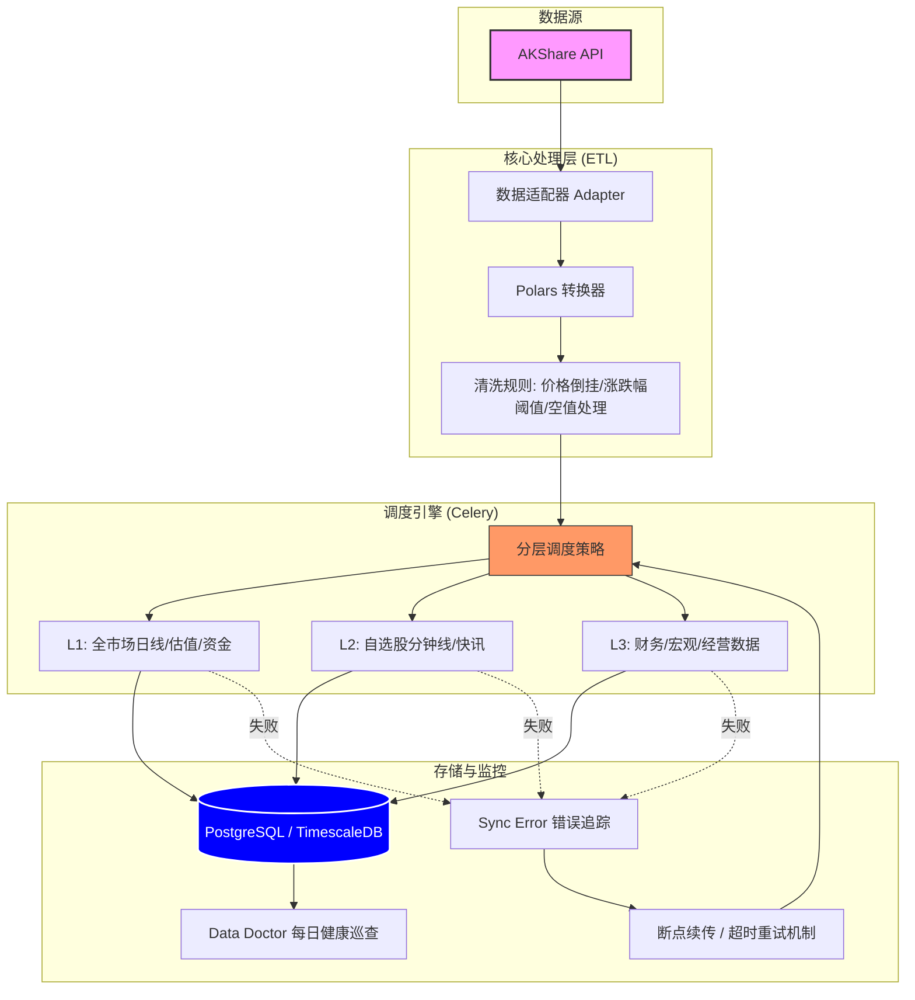

# LeekSaver 数据架构手册

## 数据库架构概览

### 1. 核心设计理念
LeekSaver 采用 **“时序行情 + 向量资讯 + 关联基础”** 的三位一体设计，旨在满足极速回测、深度财务分析及 AI 智能问答的多重需求。

### 2. 核心实体关系 (ER Logic)
- **锚点**: 以 `stocks` (股票/ETF 基础档案) 为全库中心。
- **行情轴**: `daily_quotes` / `minute_quotes` 通过 `code` 挂载时序行情。
- **深度轴**: `financial_statements` / `operation_data` 提供基本面支撑。
- **归类轴**: `sectors` ↔ `stocks` 通过行业代码/板块代码实现多维度聚合。

### 3. 技术特性
- **时序引擎 (TimescaleDB)**: 
    - 对 `daily_quotes` (按天分区) 和 `minute_quotes` (按分钟分区) 启用 **超表 (Hypertables)**。
    - 针对海量数据自动进行块压缩和高效索引，支撑毫秒级趋势查询。
- **AI 语义增强 (pgvector)**:
    - 资讯类表集成 `embedding` 向量字段 (1024 维)。
    - 支持 **语义查新闻**：不仅能搜关键词，还能根据语义相关性召回行业利好或利空消息。

### 4. 同步分层策略 (Sync Layers)
| 层次 | 定义 | 同步范围 | 触发频率 | 典型数据 |
| :--- | :--- | :--- | :--- | :--- |
| **L1** | 核心快照 | 全市场 (5000+) | 每日收盘/实时 | 日线、估值、资金流、涨停池 |
| **L2** | 深度追踪 | 仅自选股 (Watchlist) | 高频/每小时 | 分时线、实时快讯、个股深度新闻 |
| **L3** | 基础档案 | 全市场 (增量/全量) | 周级/月级 | 财务报表、经营数据、宏观指标 |

### 5. 数据流水线架构 (Data Pipeline)



---

## 数据库状态表

| 表名 | 中文名 | 类型 | 来源 | 接口 | 同步器 | 分层 | 数据量 | 备注 |
| :--- | :--- | :-: | :-: | :--- | :--- | :-: | --: | :--- |
| `daily_quotes` | 日线行情 | 超表 | AKShare | `stock_zh_a_hist` | `sync_daily_quotes` | L1 | 3,092,054 | 核心行情 (TimescaleDB) |
| `financial_statements` | 财务报表 | 普通 | AKShare | `stock_financial_abstract_ths` | `sync_financial_statements` | L3 | 42,893 | 每季度更新 |
| `stocks` | 股票列表 | 普通 | AKShare | `stock_info_a_code_name` | `sync_stock_list` | L1 | 6,795 | 基础档案 |
| `daily_valuations` | 每日估值 | 普通 | AKShare | `stock_zh_a_spot_em` | `sync_daily_valuation` | L1 | 5,471 | PE/PB/市值等 |
| `macro_indicators` | 宏观指标 | 普通 | AKShare | `macro_china_gdp` 等 | `sync_macro_economic_data` | L3 | 4,739 | GDP/CPI/PMI 等 |
| `margin_trades` | 融资融券 | 普通 | AKShare | `stock_margin_detail_szse` | `sync_margin_trade` | L1 | 3,992 | T+1 披露 |
| `stock_news_articles` | 股票新闻 | 普通 | AKShare | `stock_news_em` | `sync_stock_news_rotation` | L2 | 2,021 | 个股深度新闻 (东财) |
| `minute_quotes` | 分时行情 | 超表 | AKShare | `stock_zh_a_minute` | `sync_minute_quotes` | L2 | 1,666 | 分钟行情 (TimescaleDB) |
| `sectors` | 板块基础 | 普通 | AKShare | `stock_board_industry_name_em` | `sync_sector_quotes` | L1 | 527 | 行业/概念分类 |
| `sector_quotes` | 板块行情 | 普通 | AKShare | `stock_board_industry_name_em` | `sync_sector_quotes` | L1 | 527 | 板块指数行情 |
| `stock_fund_flows` | 资金流向 | 普通 | AKShare | `stock_individual_fund_flow_rank` | `sync_stock_fund_flow` | L1 | 299 | 个股主力资金 |
| `news_articles` | 全市快讯 | 普通 | AKShare | `stock_info_global_cls` | `sync_global_news` | L2 | 179 | 财联社电报 |
| `limit_up_stocks` | 涨停股 | 普通 | AKShare | `stock_zt_pool_em` | `sync_market_sentiment` | L1 | 155 | 每日涨停池 |
| `dragon_tiger` | 龙虎榜 | 普通 | AKShare | `stock_lhb_detail_em` | `sync_dragon_tiger` | L1 | 82 | 异常波动上榜 |
| `operation_data` | 经营数据 | 普通 | AKShare | `stock_individual_info_em` | `sync_operation_data` | L3 | 45 | 主营构成/KV数据 |
| `northbound_flows` | 北向资金 | 普通 | AKShare | `stock_hsgt_fund_flow_summary_em` | `sync_northbound_flow` | L1 | 2 | 沪深港通流量 |
| `watchlist` | 自选股 | 普通 | 用户 | - | - | 特殊 | 1 | 用户关注列表 |
| `market_sentiments` | 市场情绪 | 普通 | 计算获取 | `daily_quotes` | `sync_market_sentiment` | L1 | 1 | 涨跌分布/连板高度 |
| `alembic_version` | 数据库版本 | 普通 | 系统 | - | - | 特殊 | 1 | 迁移记录 |
| `tech_indicators` | 技术指标 | 普通 | 计算获取 | `daily_quotes` | `calculate_tech_indicators` | L1 | 0 | 预计算 MA/MACD/RSI |
| `sync_errors` | 同步错误 | 普通 | 系统 | - | - | 特殊 | 0 | 错误追踪 |

## 常用查询命令

### Celery 任务操作
- **手动触发同步 (以经营数据为例)**:
  ```bash
  docker exec leeksaver-celery-worker celery -A app.tasks.celery_app call app.tasks.sync_tasks.sync_operation_data
  ```
- **查看 Celery Worker 日志**:
  ```bash
  docker logs --tail 100 leeksaver-celery-worker
  ```

### 数据库查询
- **查询总量**:
  ```sql
  docker exec leeksaver-db psql -U leeksaver -d leeksaver -c "SELECT count(*) FROM xxx ;"
  ```
- **查看最近同步记录**:
  ```sql
  docker exec leeksaver-db psql -U leeksaver -d leeksaver -c "SELECT * FROM xxx ORDER BY created_at DESC LIMIT 10;"
  ```

## 数据库表字段

### 1. 基础与板块信息
- **`stocks` (股票/ETF 基础信息表)**
  - `code` (String): 股票代码 (主键)
  - `name` (String): 股票名称
  - `market` (String): 市场 (SH-上海, SZ-深圳, BJ-北京)
  - `asset_type` (String): 类型 (stock-股票, etf-ETF)
  - `industry` (String): 所属行业
  - `list_date` (Date): 上市日期
  - `is_active` (Boolean): 是否正常交易
- **`watchlist` (自选股表)**
  - `id` (Integer): 自增主键
  - `code` (String): 股票代码
  - `sort_order` (Integer): 排序顺序
  - `note` (String): 备注
- **`sectors` (板块基础信息表)**
  - `code` (String): 板块代码 (主键)
  - `name` (String): 板块名称
  - `sector_type` (String): 板块类型 (industry/concept/region)
  - `level` (Integer): 板块级别 (1/2/3)
  - `parent_code` (String): 父板块代码
  - `is_active` (Boolean): 是否活跃

### 2. 行情数据
- **`daily_quotes` (日线行情表)**
  - `code` (String): 股票代码 (复合主键)
  - `trade_date` (Date): 交易日期 (复合主键)
  - `open` (Numeric): 开盘价
  - `high` (Numeric): 最高价
  - `low` (Numeric): 最低价
  - `close` (Numeric): 收盘价
  - `volume` (BigInteger): 成交量 (股)
  - `amount` (Numeric): 成交额 (元)
  - `change` (Numeric): 涨跌额
  - `change_pct` (Numeric): 涨跌幅 (%)
  - `turnover_rate` (Numeric): 换手率 (%)
- **`minute_quotes` (分时行情表)**
  - `code` (String): 股票代码 (复合主键)
  - `timestamp` (DateTime): 时间戳 (复合主键)
  - `open` (Numeric): 开盘价
  - `high` (Numeric): 最高价
  - `low` (Numeric): 最低价
  - `close` (Numeric): 收盘价
  - `volume` (BigInteger): 成交量
- **`sector_quotes` (板块行情表)**
  - `id` (Integer): 自增主键
  - `sector_code` (String): 板块代码
  - `trade_date` (Date): 交易日期
  - `index_value` (Numeric): 板块指数
  - `change_pct` (Numeric): 涨跌幅 (%)
  - `change_amount` (Numeric): 涨跌额
  - `total_volume` (Integer): 总成交量 (手)
  - `total_amount` (Numeric): 总成交额 (元)
  - `rising_count` (Integer): 上涨家数
  - `falling_count` (Integer): 下跌家数
  - `leading_stock` (String): 领涨股代码
  - `leading_stock_pct` (Numeric): 领涨股涨跌幅 (%)

### 3. 财务与经营数据
- **`financial_statements` (财务报表表)**
  - `code` (String): 股票代码 (复合主键)
  - `end_date` (Date): 报告期截止日 (复合主键)
  - `pub_date` (Date): 公告日期
  - `report_type` (String): 报告类型 (一季报/中报/三季报/年报)
  - `total_revenue` (Numeric): 营业总收入
  - `net_profit` (Numeric): 归母净利润
  - `deduct_net_profit` (Numeric): 扣非净利润
  - `net_cash_flow_oper` (Numeric): 经营活动产生的现金流量净额
  - `roe_weighted` (Numeric): 加权净资产收益率 (%)
  - `gross_profit_margin` (Numeric): 毛利率 (%)
  - `net_profit_margin` (Numeric): 净利率 (%)
  - `revenue_yoy` (Numeric): 营业收入同比增长率 (%)
  - `net_profit_yoy` (Numeric): 归母净利润同比增长率 (%)
  - `debt_asset_ratio` (Numeric): 资产负债率 (%)
  - `eps` (Numeric): 基本每股收益
  - `bps` (Numeric): 每股净资产
- **`operation_data` (经营数据表)**
  - `id` (Integer): 自增主键
  - `code` (String): 股票代码
  - `period` (String): 报告期 (YYYY-MM-DD/YYYYQN)
  - `metric_name` (String): 指标名称
  - `metric_category` (String): 指标分类
  - `metric_value` (Numeric): 指标数值
  - `metric_value_text` (String): 指标文本值
  - `unit` (String): 单位
  - `source` (String): 数据来源
  - `remark` (String): 备注

### 4. 估值与技术指标
- **`daily_valuations` (每日估值表)**
  - `code` (String): 股票代码 (复合主键)
  - `trade_date` (Date): 交易日期 (复合主键)
  - `pe_ttm` (Numeric): 市盈率 (TTM)
  - `pe_static` (Numeric): 市盈率 (静态)
  - `pb` (Numeric): 市净率
  - `ps_ttm` (Numeric): 市销率 (TTM)
  - `peg` (Numeric): PEG
  - `total_mv` (Numeric): 总市值 (亿元)
  - `circ_mv` (Numeric): 流通市值 (亿元)
  - `dv_ttm` (Numeric): 股息率 (TTM) (%)
- **`tech_indicators` (技术指标预计算表)**
  - `code` (String): 股票代码 (复合主键)
  - `trade_date` (Date): 交易日期 (复合主键)
  - `ma5` (Numeric): 5日均线
  - `ma10` (Numeric): 10日均线
  - `ma20` (Numeric): 20日均线
  - `ma60` (Numeric): 60日均线
  - `macd_dif` (Numeric): MACD DIF
  - `macd_dea` (Numeric): MACD DEA
  - `macd_bar` (Numeric): MACD Bar (柱状)
  - `rsi_14` (Numeric): 14日RSI
  - `kdj_k` (Numeric): KDJ K值
  - `kdj_d` (Numeric): KDJ D值
  - `kdj_j` (Numeric): KDJ J值
  - `boll_upper` (Numeric): 布林带上轨
  - `boll_middle` (Numeric): 布林带中轨
  - `boll_lower` (Numeric): 布林带下轨
  - `cci` (Numeric): CCI指标
  - `atr_14` (Numeric): 14日ATR
  - `obv` (BigInteger): OBV (累积成交量)

### 5. 资金面数据
- **`northbound_flows` (北向资金表)**
  - `trade_date` (Date): 交易日期 (主键)
  - `sh_net_inflow` (Numeric): 沪股通净流入 (亿元)
  - `sh_buy_amount` (Numeric): 沪股通买入金额 (亿元)
  - `sh_sell_amount` (Numeric): 沪股通卖出金额 (亿元)
  - `sz_net_inflow` (Numeric): 深股通净流入 (亿元)
  - `sz_buy_amount` (Numeric): 深股通买入金额 (亿元)
  - `sz_sell_amount` (Numeric): 深股通卖出金额 (亿元)
  - `total_net_inflow` (Numeric): 北向资金净流入合计 (亿元)
- **`stock_fund_flows` (个股资金流向表)**
  - `code` (String): 股票代码 (复合主键)
  - `trade_date` (Date): 交易日期 (复合主键)
  - `main_net_inflow` (Numeric): 主力净流入 (万元)
  - `main_inflow` (Numeric): 主力流入 (万元)
  - `main_outflow` (Numeric): 主力流出 (万元)
  - `super_large_net` (Numeric): 超大单净流入 (万元)
  - `large_net` (Numeric): 大单净流入 (万元)
  - `medium_net` (Numeric): 中单净流入 (万元)
  - `small_net` (Numeric): 小单净流入 (万元)
  - `main_net_pct` (Numeric): 主力净占比 (%)
- **`margin_trades` (融资融券表)**
  - `code` (String): 股票代码 (复合主键)
  - `trade_date` (Date): 交易日期 (复合主键)
  - `rzye` (Numeric): 融资余额 (元)
  - `rzmre` (Numeric): 融资买入额 (元)
  - `rzche` (Numeric): 融资偿还额 (元)
  - `rzjme` (Numeric): 融资净买入 (元)
  - `rqye` (Numeric): 融券余额 (元)
  - `rqyl` (BigInteger): 融券余量 (股)
  - `rqmcl` (BigInteger): 融券卖出量 (股)
  - `rqchl` (BigInteger): 融券偿还量 (股)
  - `rzrqye` (Numeric): 融资融券余额 (元)
- **`dragon_tiger` (龙虎榜数据表)**
  - `id` (Integer): 自增主键
  - `code` (String): 股票代码
  - `name` (String): 股票名称
  - `trade_date` (Date): 交易日期
  - `reason` (String): 上榜原因
  - `buy_amount` (Numeric): 龙虎榜买入额 (万元)
  - `sell_amount` (Numeric): 龙虎榜卖出额 (万元)
  - `net_amount` (Numeric): 龙虎榜净买入 (万元)
  - `close` (Numeric): 收盘价
  - `change_pct` (Numeric): 涨跌幅 (%)
  - `turnover_rate` (Numeric): 换手率 (%)

### 6. 市场情绪
- **`market_sentiments` (市场情绪指标表)**
  - `trade_date` (Date): 交易日期 (主键)
  - `rising_count` (Integer): 上涨家数
  - `falling_count` (Integer): 下跌家数
  - `flat_count` (Integer): 平盘家数
  - `limit_up_count` (Integer): 涨停家数
  - `limit_down_count` (Integer): 跌停家数
  - `advance_decline_ratio` (Numeric): 涨跌比 (上涨/下跌)
  - `continuous_limit_up_count` (Integer): 连板家数 (2板及以上)
  - `max_continuous_days` (Integer): 最高连板天数
  - `highest_board_stock` (String): 最高连板股票代码
  - `turnover_gt_10_count` (Integer): 换手率 > 10% 家数
  - `turnover_5_10_count` (Integer): 换手率 5-10% 家数
  - `turnover_lt_1_count` (Integer): 换手率 < 1% 家数
  - `avg_turnover_rate` (Numeric): 全市场平均换手率 (%)
  - `total_volume` (BigInteger): 市场总成交量 (手)
  - `total_amount` (Numeric): 市场总成交额 (亿元)
- **`limit_up_stocks` (涨停股票详情表)**
  - `id` (Integer): 自增主键
  - `code` (String): 股票代码
  - `name` (String): 股票名称
  - `trade_date` (Date): 交易日期
  - `limit_up_time` (String): 首次涨停时间 (HH:MM:SS)
  - `open_count` (Integer): 开板次数
  - `continuous_days` (Integer): 连板天数
  - `industry` (String): 所属行业
  - `concept` (String): 涨停概念
  - `turnover_rate` (Numeric): 换手率 (%)
  - `amount` (Numeric): 成交额 (万元)
  - `seal_amount` (Numeric): 封单金额 (万元)

### 7. 资讯与宏观
- **`news_articles` (全市快讯表)**
  - `id` (Integer): 自增主键
  - `cls_id` (Integer): 财联社原生 ID
  - `title` (String): 标题
  - `content` (Text): 正文
  - `source` (String): 来源 (默认财联社)
  - `publish_time` (DateTime): 发布时间
  - `url` (String): 链接
  - `importance_level` (Integer): 重要性级别 (1-5)
  - `related_stocks` (String): 关联股票代码
  - `keywords` (String): 分类标签
  - `raw_data` (JSON): 原始 JSON 数据
  - `embedding` (Vector): 文本向量 (1024维)
- **`stock_news_articles` (个股深度新闻表)**
  - `id` (Integer): 自增主键
  - `stock_code` (String): 关联股票代码
  - `title` (String): 标题
  - `content` (Text): 正文
  - `source` (String): 来源
  - `publish_time` (DateTime): 发布时间
  - `url` (String): 链接
  - `keywords` (String): 关键词
  - `raw_data` (JSON): 原始数据
  - `embedding` (Vector): 文本向量 (1024维)
- **`macro_indicators` (宏观指标表)**
  - `id` (Integer): 主键 ID
  - `indicator_name` (String): 指标名称 (GDP/CPI/PMI等)
  - `indicator_category` (String): 指标分类
  - `period` (Date): 统计周期
  - `period_type` (String): 周期类型 (月度/季度/年度)
  - `value` (Numeric): 指标值
  - `yoy_rate` (Numeric): 同比增长率 (%)
  - `mom_rate` (Numeric): 环比增长率 (%)
  - `unit` (String): 数据单位

### 8. 系统监控
- **`sync_errors` (同步错误记录表)**
  - `id` (Integer): 自增主键
  - `task_name` (String): 任务名称
  - `target_code` (String): 目标股票代码
  - `error_type` (String): 错误类型
  - `error_message` (Text): 错误详细信息
  - `retry_count` (Integer): 重试次数
  - `last_retry_at` (DateTime): 最后重试时间
  - `created_at` (DateTime): 创建时间
  - `resolved_at` (DateTime): 成功恢复的时间
- **`alembic_version` (数据库版本表)**
  - `version_num` (String): 当前数据库版本 Hash
